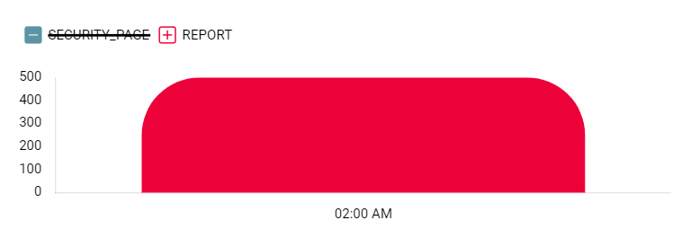

# chartjs-plugin-custom-legend

### This is a plugin for replacing chartjs legend to images. 

  
        
 The module on [npm](https://www.npmjs.com/package/chartjs-plugin-custom-legend) 
 
 ### install:
 
    npm i chartjs-plugin-custom-legend
   
   
here, the legend items are images
 

they change by click/hover you need to pass the images to each dataset.
as you can see I also added margin between the legend to the chart 

let's see the code:

    import {LegendHover, LegendClick, LegendBottomMargin} from "chartjs-plugin-custom-legend"
    import { Chart as ChartJS, Legend } from "chart.js";

    ChartJS.register(
    LegendClick,
    LegendHover,
    LegendBottomMargin(20),
    Legend,
    ///...rest of the chart plugins
    );

    const dataset = {
         label:"some label text",
         data:[{y: 50, x: new Date()}],
         // now here we give each dataset its legend item image
         
         // the initial image, mostly you put the same image as the primaryImage
         pointStyle: primaryIMAGE
    
         //the image in its regular state.
         primaryImage: primaryIMAGE

         // the image in its selected state.
         selectedImage: selectedIMAGE

         // this is a must to track the latest image which is the primary image at initial.  
         lastImage: primaryIMAGE

         // required only if you use hover plugin.
         primaryHoverImage:  primaryHoverIMAGE
         selectedHoverImage: SelectedHoverIMAGE
    }

    // now only render the chart.
    const BarChart = () => {
        return <Bar options={{//whatever your options are...}} data={{datasets:[dataset]}} />;
    };

    
    
    export default BarChart;
